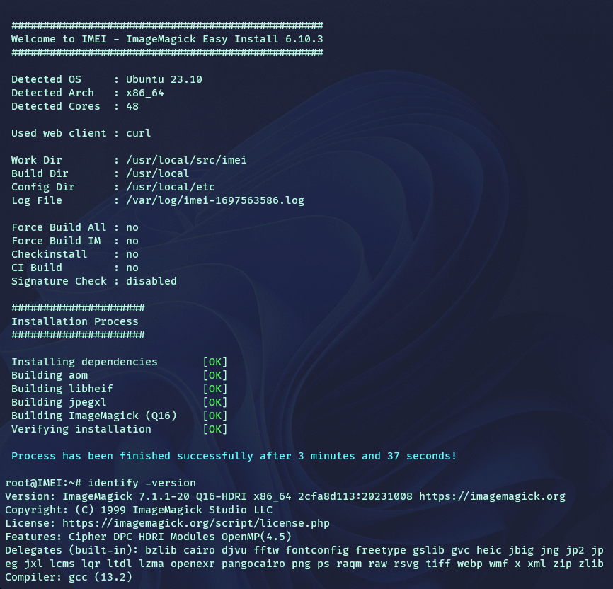

<div align=center>

# IMEI - ImageMagick Easy Install
#### Automated ImageMagick compilation from sources for Debian/Ubuntu including advanced delegate support.

[](https://github.com/SoftCreatR/imei/actions/workflows/Main.yml)

[](https://github.com/SoftCreatR/imei/commits/main) [](https://github.com/SoftCreatR/imei/releases) [](LICENSE.md) [](https://ecologi.com/softcreatr?r=61212ab3fc69b8eb8a2014f4)   [](https://github.com/SoftCreatR/imei/blob/main/imei.sh)

[](https://app.codacy.com/gh/SoftCreatR/imei/dashboard) [](https://www.codefactor.io/repository/github/softcreatr/imei)

</div>

---

<div align="center">

<a href="#features"> Features<a> •
<a href="#compatibility"> Compatibility</a> •
<a href="#usage"> Usage</a> •
<a href="#contributing"> Contributing</a> •
<a href="#license"> License</a>



</div>

---

## Features

* Compiles the latest ImageMagick release
* Installs ImageMagick or updates ImageMagick package previously installed (via IMEI)
* Additional HEIF support
* Additional HEIX support
* Additional AVIF support
* Additional JPEG XL support

---

## Compatibility

Every IMEI build will be automatically tested against the latest Ubuntu LTS Versions (16.04 and newer) using GitHub Actions. Compatibility with other operating systems (such as Debian 10) is tested manually.

### Operating System

#### Recommended

* Ubuntu 20.04 (__Focal__ Fossa)
* Ubuntu 18.04 (__Bionic__ Beaver)
* Debian 10 (__Buster__)
* Raspbian 10 (__Buster__)

#### Also compatible

* Ubuntu 21.10 (__Impish__ Indri)
* Ubuntu 21.04 (__Hirsute__ Hippo)
* Ubuntu 20.10 (__Groovy__ Gorilla)
* Ubuntu 19.10 (__Eoan__ Ermine)
* Ubuntu 17.04 (__Zesty__ Zapus)
* Ubuntu 16.04 (__Xenial__ Xerus)
* Debian 11 (__Bullseye__)
* Debian 9 (__Stretch__)
* Raspbian 9 (__Stretch__)

#### Known issues

* For JPEG XL, CMake 3.10 or newer is required. On older systems (e.g. Debian 9), the maintainers version isn't sufficient. In this case, JPEG XL compilation will be skipped.
* For libaom, CMake 3.6 or newer is required. On older systems, the maintainers version may be not sufficient. In this case, libaom compilation will be skipped. Without libaom, libheif will be skipped too.

---

## Usage

### One-Step Automated Install

```bash
t=$(mktemp) && \
wget 'https://dist.1-2.dev/imei.sh' -qO "$t" && \
bash "$t" && \
rm "$t"
```

### Alternative Install Method

```bash
git clone https://github.com/SoftCreatR/imei && \
cd imei && \
chmod +x imei.sh && \
./imei.sh
```

### Verify installer integrity

Though the installer performs a self check upon startup, you can also perform it manually.
To do so, `openssl` is required:

```bash
wget https://dist.1-2.dev/imei.sh && \                                  # Download IMEI
wget https://dist.1-2.dev/imei.sh.sig && \                              # Download signature file
wget https://dist.1-2.dev/imei.sh.pem && \                              # Download public key
openssl dgst -sha512 -verify imei.sh.pem -signature imei.sh.sig imei.sh # Verify
```

### Alternative integrity check

```bash
git clone https://github.com/SoftCreatR/imei && \
cd imei && \
openssl dgst -sha512 -verify imei.sh.pem -signature imei.sh.sig imei.sh
```

#### Options available

Currently available build options are

* `--skip-dependencies` / `--skip-deps` : Skip installation of dependencies
* `--imagemagick-version` / `--im-version` : Build the given ImageMagick version (e.g. `7.0.10-28`)
* `--force-imagemagick` / `--force-im` : Force building of ImageMagick only, even if it's are already installed in a newer or the latest version
* `--imagemagick-quantum-depth` / `--im-q` : ImageMagick Quantum Depth (8, 16 or 32)
* `--aom-version` : Build the given aom version (e.g. `2.0.0`)
* `--skip-aom` : Skip building aom
* `--libheif-version` / `--heif-version` : Build the given libheif version (e.g. `1.8.0`)
* `--skip-libheif` / `--skip-heif` : Skip building libheif
* `--jpeg-xl-version` / `--jxl-version` : Build the given JPEG XL version (e.g. `0.3.3`)
* `--skip-jpeg-xl` / `--skip-jxl` : Skip building JPEG XL
* `--log-file` : Log everything to the file provided
* `--work-dir` : Download, extract & build within the directory provided
* `--build-dir` : Build target directory for ImageMagick
* `--config-dir` : Config target directory for ImageMagick
* `--force` : Force building of components, even if they are already installed in a newer or the latest version

Additional options / switches:

* `--no-sig-verify` / `--dev` : Disable signature verification on startup
* `--use-checkinstall` / `--checkinstall` : Use `checkinstall` instead of `make`
* `--no-backports` : Disable temporary installation of OS backports (they may be used anyways, depending on your server configuration)

**Default options** :

<!-- versions start -->
* ImageMagick version: `7.1.0-32 (Q16)`
* libaom version: `3.3.0`
* libheif version: `1.12.0`
* libjxl version: `0.6.1`<!-- versions end -->
* Log File: `/var/log/imei.log`
* Work Dir: `/usr/local/src/imei`
* Build Dir: `/usr/local`
* Config Dir: `/usr/local/etc`

### checkinstall vs. make

IMEI supports both, `checkinstall` and `make`. While `checkinstall` creates packages that you can uninstall at a later time (e.g. `apt remove imei-imagemagick`), `make` doesn't, therefore it may be harder to remove everything, that has been installed by IMEI. However, `checkinstall` isn't always available and it contains some bugs, that might result in a broken installation of IMEI`s packages.

IMEI uses `make` by default, but you can use `checkinstall` via option (see "Additional options / switches") instead.

---

## Contributing

If you have any ideas, just open an issue and describe what you would like to add/change in IMEI.

If you'd like to contribute, please fork the repository and make changes as you'd like. Pull requests are warmly welcome.

## License 🌳

[ISC](LICENSE.md) © [1-2.dev](https://1-2.dev)

This package is Treeware. If you use it in production, then we ask that you [**buy the world a tree**](https://ecologi.com/softcreatr?r=61212ab3fc69b8eb8a2014f4) to thank us for our work. By contributing to the ecologi project, you’ll be creating employment for local families and restoring wildlife habitats.
